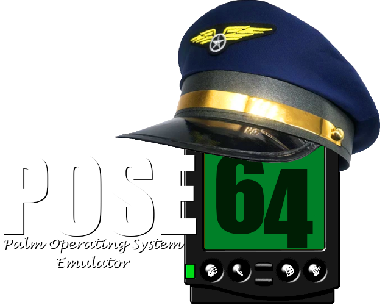
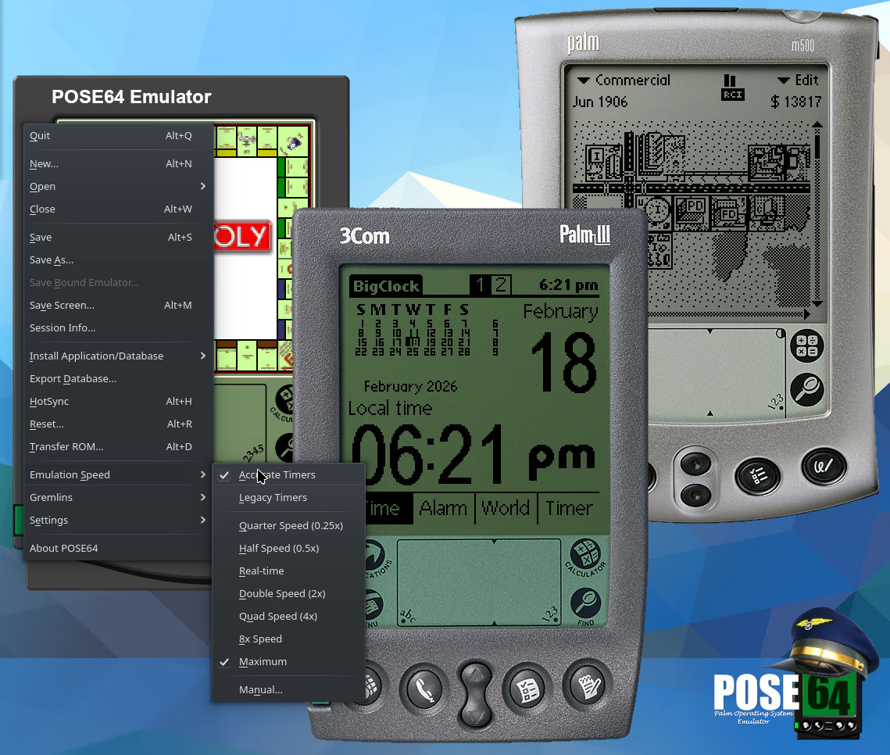

<p align="center">
  
</p>

A native 64-bit port of POSE 3.5, the original Palm OS Emulator from 2001! POSE shipped with the official SDK—and I've now learned it was broken as hell. Well, now it's ported to Qt6 from FLTK 1.1 and compiled for modern GNU/Linux.

## Origins
So POSE was made with version ~0.8 of UAE, a Motorola 68k emulator which was at the time called the Ubiquitous Amiga Emulator. A few years before that, it was the Unusable Amiga Emulator. It's now called the Universal Amiga Emulator and still in active development in several branches.

I tried very hard to update the UAE core in POSE64 to the latest version, but it was a waste of time. Any limitations of version ~0.8 are not, as far as I can tell, a ceiling or bottleneck on emulating Palm Pilots. It's just a Palm Pilot.

FLTK is still a thriving toolkit, and I could have kept with that, but I don't know FLTK at all. I know Qt much better. Further, I'm releasing this as POSE64 as something of a baseline for derivation. I needed a Palm Emulator, so I decided to begin with a faithful port of POSE before I began mangling into for my own purposes. This is 0.9 because I'm sure there are bugs, and I hope version 1.0 satisfies everyone as a minimal continuation of the 25-year old original it strives to update. And that's the last version I'll ever care about.

I hope my humble artwork is satisfactory for the occasion of this quarter-century resurrection.



## Features

- **Full Palm OS emulation** — boots PalmOS 2.0 through 4.1 ROMs with
  DragonBall 328, EZ, and VZ processor emulation
- **Device skins** — uses the same skins as the original POSE with a few rendering improvements
- **Gremlins** — automated random-input testing
- **Session management** — save and restore complete device state
- **Clipboard sync** — bidirectional text clipboard with the host
- **Database management** — install and export PRC/PDB/PQA files

These are all features of the original 25 year old emulator. Added is a **new Speed control**: 0.25x to 8x of “realtime” (or any custom fraction), with cycle-accurate timer mode. I put “realtime” in scare quotes because I made a 16-variable benchmark application and wasted a whole day trying to get the emulator to address different areas at realistic speeds. That was far too challenging; read the `docs/` for more.

Supported devices might include: Palm Pilot, Palm III/IIIc/IIIe/IIIx, Palm V/Vx,
Palm m100/m130/m500/m515, Handspring Visor, and others! Most aren't tested—give them a shot!

You'll find everything you need to make Debian packages and AppImages in the folder.

## Prerequisites

### Arch / Manjaro

| Package | What For |
|---|---|
| `base-devel` | gcc, g++, make, cmake |
| `qt6-base` | Qt6 Core + Widgets |
| `libx11` | X11 (clipboard/display) |
| `zlib` | Compression (session files) |

### Debian / Ubuntu

| Package | What For |
|---|---|
| `build-essential` | gcc, g++, make |
| `cmake` | Build system |
| `qt6-base-dev` | Qt6 Core + Widgets |
| `libx11-dev` | X11 headers |
| `zlib1g-dev` | Compression headers |

## Build

```bash
mkdir build && cd build
cmake ..
make -j$(nproc)
```

### Debug build

```bash
cmake .. -DPOSE_DEBUG=ON
make -j$(nproc)
```

See `docs/debugging-guide.md` for the full reference.

## Install

```bash
cmake --install build --prefix /usr/local
```

This installs the binary, skins, desktop entry, and icon.

## Run

```bash
pose64

# With a saved session
pose64 -psf /path/to/Session.psf
```

You will need a Palm OS ROM file to create a new session.

### Debian package

```bash
sudo apt install build-essential debhelper cmake qt6-base-dev libx11-dev zlib1g-dev
dpkg-buildpackage -us -uc -b
```

The `.deb` lands in the parent directory.

### AppImage

```bash
./scripts/build-appimage.sh
```

This downloads [linuxdeploy](https://github.com/linuxdeploy/linuxdeploy) and its
Qt plugin, builds POSE64, bundles all dependencies, and produces a portable
`POSE64-x86_64.AppImage` in the project root. Build on the oldest distro you
want to support for maximum compatibility.

## Timing

All this was co-developed with Claude Code. I don't think it's too sloppy,
however. Anyway, here is Claude's explanation of the new timing controls:

The original POSE had a dirty secret: it couldn't tell time. The DragonBall
hardware timers — which PalmOS depends on for *everything* — were advanced by
a hardcoded `increment = 4` per CPU instruction, regardless of what that
instruction actually cost. Animations ran at warp speed and `SysTaskDelay()` was
a polite suggestion.

We added speed control (the original had none — it just ran flat out) and
fixed the timers with a Bresenham-style accumulator that feeds actual UAE
cycle costs into the timer registers at the correct prescaler ratio. Then we
discovered three bugs stacked on top of each other: `CycleSlowly()` was
calling `gettimeofday()` on every single iteration of the sleep loop (tens of
thousands of syscalls per second), the sleep-cycles-per-tick calculation
returned 1 instead of 16, and a redundant `Platform::Delay()` was adding
uncontrolled latency.

With all three fixed, the speed multipliers finally worked — 0.25x was
exactly half of 0.5x. But "1x" was still ~4.78x faster than a real Palm m500.
We built a 16-variable benchmark app, ran it on actual Palm hardware, and
discovered the uncomfortable truth: UAE's cycle accounting (dating back to
version 0.8 of the Universal Amiga Emulator) systematically undercounts by
about 2.7x. Every instruction bills fewer cycles than a real MC68000 costs.

The solution: a per-device calibration table that scales the throttle clock
frequency using real-hardware benchmark data. Wall-clock speed is now correct.
Per-instruction timing is still approximate, but for a Palm Pilot, it's close
enough — the clock on screen ticks at the right speed, and that's what matters.

See `docs/timer-accuracy-findings.md` and `docs/benchmark-analysis-m500.md`
for the full saga.

## License

GPL v3 — see [LICENSE](LICENSE) for details.
